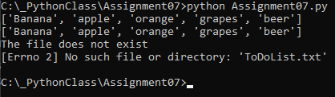

# Assignment07
Ryan Clabots 
2-28-22

## Introduction
This week we learned about Pickling data and Error Handling. This script shows two simple scripts to demonstrate the concepts.

## Writing the Script
```markdown
# ---------------------------------------------------------------------------- #
# Title: Assignment 07
# Description: Demonstrate examples of pickling data as well as error handling
# ChangeLog (Who,When,What):
# RClabots,2.27.2022,Created script
# ---------------------------------------------------------------------------- #
# Declare my variables
lstRow = []  # list of data
objFile = None  # file handle

# Pickling ------------------------------------------------------------------ #
import pickle

def store_data():
    objFile = open('PickledList.txt', 'ab')
    strList = ['Banana', 'apple', 'orange', 'grapes', 'beer']
    print(strList)
    pickle.dump(strList, objFile)
    objFile.close()

def load_data():
    objFile = open('PickledList.txt', 'rb')
    unpickle = pickle.load(objFile)
    print(unpickle)

store_data()
load_data()

```
##### Figure 1 - Pickling part of the script
For the pickling section, two functions were used, one to store the data and the other to unpack it. The `pickle` module is imported first. The `store_data` function opens a text file in bianary append mode, creates a list, and prints the data before it's pickled. The list is then pickled using the `dump` object and the file then closed. The `load_data` function is then called and once again opens the file in a read bianary mode. The pickled data is then loaded using the `load` opject into a variable that is printed to show how the data remains intact.

&nbsp;

```markdown
# Error Handling ------------------------------------------------------------- #

# Processing Data (Add data to list section from Assignment06)
try:
    objFile = open('ToDoList.txt', "r")
    for row in objFile:
        lstRow = row.split(" | ")
        print(lstRow[0] + " | " + lstRow[1].strip())
        dicRow = {"Task": lstRow[0], "Priority": lstRow[1].strip()}
        lstTable.append(dicRow)
    objFile.close()

except FileNotFoundError as e:
    print("The file does not exist")
    print(e)

```
##### Figure 2 - Error Handling part of script
The error handling case uses an example from Assignment06 where the user is trying to add data to a dictionary table. This example shows how the error handling is used if the file that is being opened does not exist. The `FileNotFoundError` error handle is used in this case and captured as `e`. The user is notified that the file does not exist and the error is printed.

&nbsp;

## Running the Stript

##### Figure 3 - Running the script in Pycharm's console

&nbsp;


##### Figure 4 - Running the script in the CMD Shell
